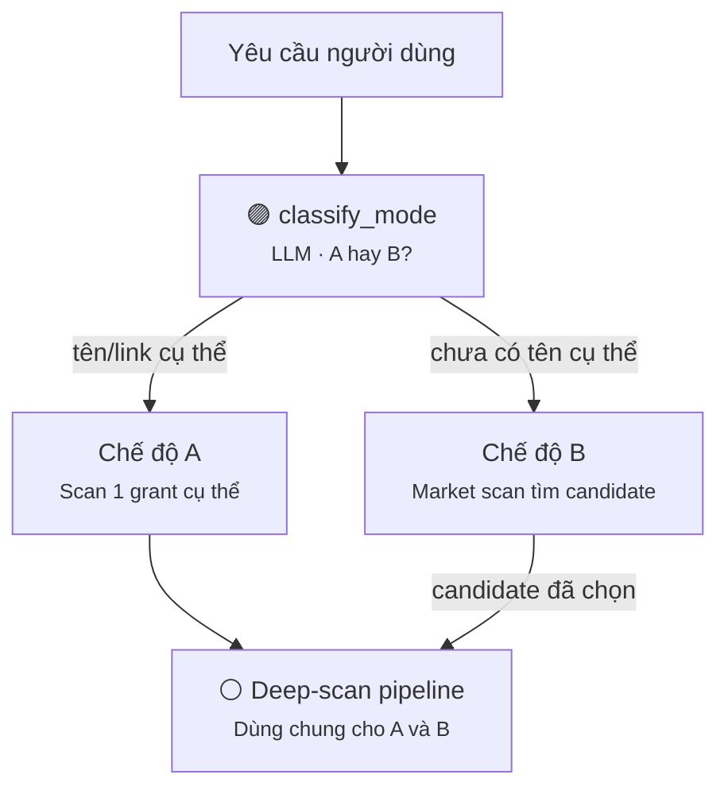
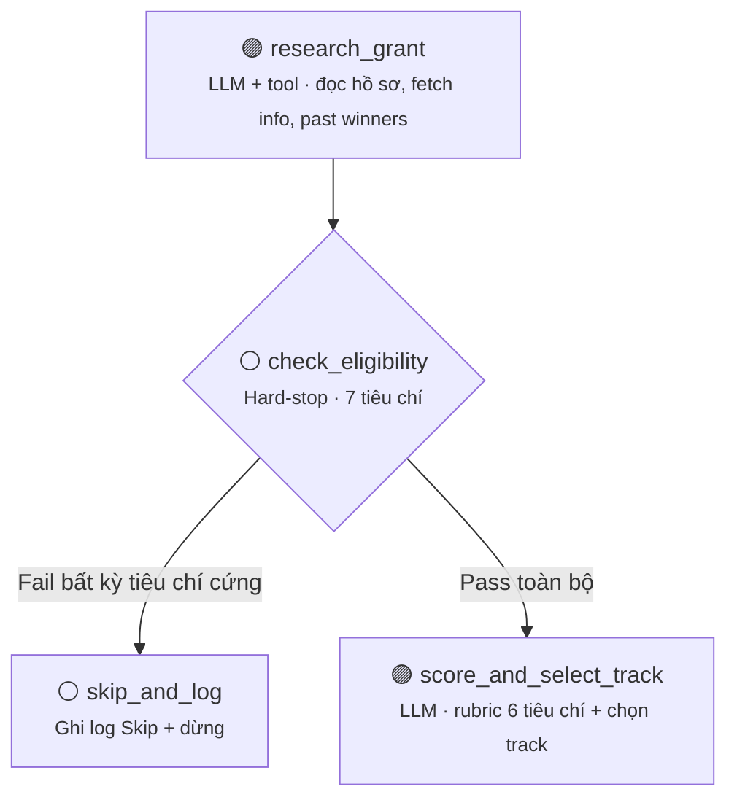
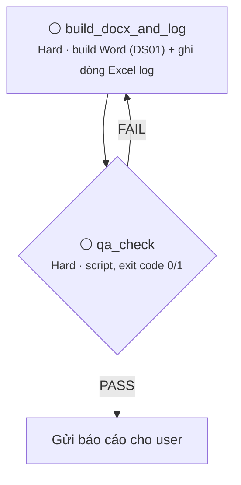
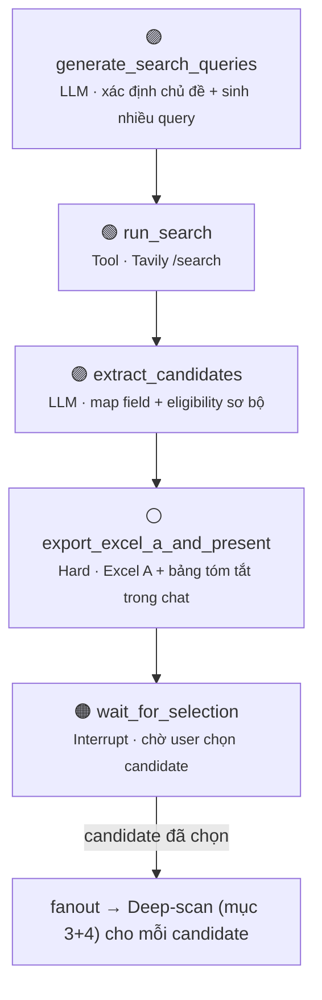

# Workflow: scan-grant-vnf trên LangGraph

Tài liệu này mô tả cách chuyển skill `scan-grant-vnf` (đánh giá & quét thị trường grant cho
RetriV/VNF) sang một `StateGraph` LangGraph chạy độc lập, không phụ thuộc vào Claude/agent
framework nào cụ thể. Nguyên tắc thiết kế: **graph cứng ở tầng orchestration, agent-loop chỉ ở
bên trong từng node** — mọi gate/validation bắt buộc (eligibility hard-stop, QA pass/fail, chặn
ghi thiếu field) là cạnh điều kiện xác định, không giao cho 1 agent tự do quyết định trình tự.

---

## 1. Quy ước phân loại node

| Ký hiệu | Loại | Ý nghĩa |
|---|---|---|
| 🟣 **LLM** | Model suy luận/sinh nội dung | Đọc hiểu văn bản không cấu trúc, chấm điểm theo rubric, viết nội dung, sinh query |
| 🟢 **TOOL** | Gọi API bên ngoài thuần | Tavily search/extract — không cần reasoning ở bước gọi |
| ⚪ **HARD** | Code deterministic | Đọc/ghi file, validate, tính tổng điểm, build docx/xlsx, gate điều kiện |
| 🟠 **INTERRUPT** | Điểm dừng chờ user | Dùng `interrupt()` của LangGraph, persist state, resume khi có input |

**Quy tắc chọn loại:** bất cứ bước nào sai sẽ làm sai lệch output ảnh hưởng quyết định của công ty
(tính điểm, tính tiền, ghi log thiếu field, tạo file hỏng) → **HARD**. Bất cứ bước nào cần đọc
hiểu ngữ nghĩa hoặc sinh nội dung mới → **LLM**.

---

## 2. Sơ đồ tổng quan — định tuyến Chế độ A / B



Nếu `classify_mode` không chắc chắn (input mơ hồ, không có tên/link/chủ đề) → route sang
`ask_mode_clarify` (🟠 INTERRUPT), hỏi lại rồi quay về `classify_mode`.

---

## 3. Chế độ A — Nghiên cứu & Eligibility



**`check_eligibility`**: 7 tiêu chí (geography, entity type, TRL, IP, deadline khả thi,
double-dipping, giai đoạn dự án) là bảng cố định giữ trong prompt như rule table — nhưng việc đọc
info grant rồi match từng tiêu chí cần LLM, nên node này là LLM áp khung hard, không phải
if/else thuần.

---

## 4. Chế độ A — Build file & QA gate



**`build_docx_and_log`** phải build Word **trước** rồi mới ghi Excel log, để có link file thật
điền vào cột "Link báo cáo". `log_scan_excel` tự chặn ghi nếu thiếu Lý do/Owner khi Skip/Maybe.

**`qa_check`** kiểm tra: logo có nhúng trong `word/media/` không, có Word TOC field thật không
(placeholder "Nhấn F9 để cập nhật" là **bình thường** — user tự bấm F9 trong Word, không cần bake
số trang bằng script trước khi gửi file), đủ 8 mục nội dung, và Excel log hợp lệ. Nên đặt
**max-retry** (vd 3 lần) cho vòng lặp `QA FAIL → build_docx_and_log` để tránh loop vô hạn khi lỗi
không tự sửa được (vd `logo_path` sai cấu hình) — vượt quá retry thì route sang node báo lỗi cho
user thay vì lặp mãi.

---

## 5. Chế độ B — Market Scan



**Vì sao dừng bắt buộc ở `wait_for_selection`**: deep-scan tốn nhiều thời gian/request (search,
tạo Word, ghi Excel) cho mỗi candidate — không được tự động chạy hàng loạt. Đây là 1 trong 3 điểm
`interrupt()` bắt buộc của toàn bộ workflow (cùng với `ask_mode_clarify` và bước xác nhận nguồn ở
Chế độ A khi user chỉ nêu tên chương trình mà chưa có link).

**Tavily dùng ở đâu**: `run_search` chỉ gọi `/search` lấy danh sách URL + snippet (không cần
reasoning). `extract_candidates` là node LLM riêng, dùng `/extract` (có `query` param để Tavily
rerank đoạn liên quan tới "sponsor, funding, deadline") để lấy nội dung sạch rồi tự map vào field
— **Tavily không tự trả field nghiệp vụ** (tên nhà tài trợ, funding...), phần đó luôn cần 1 LLM
node riêng.

---

## 6. Bảng tổng hợp toàn bộ node

| Node | Bước gốc trong SKILL.md | Loại | Việc chính |
|---|---|---|---|
| `classify_mode` | Bước 0a | 🟣 LLM | Phân loại Chế độ A/B từ input tự do |
| `ask_mode_clarify` | Bước 0a | 🟠 INTERRUPT | Hỏi lại khi chưa rõ chế độ |
| `resolve_source` | Bước 0b | ⚪ HARD + 🟠 INTERRUPT | Có URL thì skip; chỉ có tên thì hỏi tự tìm hay gửi link |
| `find_official_site` | Bước 0b | 🟣 LLM+TOOL | Search xác định site chính thức, đúng cohort/mùa |
| `generate_search_queries` | B1–B2 | 🟣 LLM | Xác định chủ đề, sinh nhiều query bao phủ |
| `run_search` | B2 | 🟢 TOOL | Gọi Tavily `/search` |
| `extract_candidates` | B3–B4 | 🟣 LLM | Trích field + chấm eligibility sơ bộ song song RetriV/VNF |
| `export_excel_a_and_present` | B5–B6 | ⚪ HARD | Ghi Excel A, render bảng tóm tắt trong chat |
| `wait_for_selection` | B6 | 🟠 INTERRUPT | Chờ user chọn candidate deep-scan |
| `fanout_selected_candidates` | B6b | ⚪ HARD | Map mỗi candidate được chọn → chạy subgraph deep-scan |
| `research_grant` | Bước 1–2 | 🟣 LLM+TOOL | Đọc hồ sơ công ty, fetch info grant + past winners |
| `check_eligibility` | Bước 3 | 🟣 LLM (áp khung HARD) | Chấm 7 tiêu chí hard-stop |
| `skip_and_log` | Bước 3 | ⚪ HARD | Ghi log Skip khi fail hard-stop |
| `score_and_select_track` | Bước 4–5 | 🟣 LLM | Chấm 6 tiêu chí /5, chọn track phù hợp |
| `build_docx_and_log` | Bước 6a–6b | ⚪ HARD | Build Word (DS01), ghi Excel log |
| `qa_check` | Bước 7 | ⚪ HARD | Kiểm tra logo, TOC field, đủ 8 mục, Excel hợp lệ |

---

## 7. State schema gợi ý

```ts
type Mode = "A" | "B" | "unclear";

interface EligibilityResult {
  criterion: string;
  result: "pass" | "fail" | "unclear";
  note: string;
}

interface GrantCandidate {
  name: string;
  sponsor: string;
  field: string;
  funding: string;
  deadline: string;
  geography: string;
  website: string;
  sourceNote: string; // "Claude tự tìm" | "User cung cấp link"
  prelimEligibility?: { retriv: EligibilityResult[]; vnf: EligibilityResult[] };
}

interface ScanState {
  mode: Mode;
  topic?: string;                 // Chế độ B
  candidates: GrantCandidate[];   // Chế độ B — Excel A
  selectedCandidates: string[];   // tên/STT user chọn ở wait_for_selection

  currentGrant?: GrantCandidate;
  companyTarget: "RetriV" | "VNF";
  eligibility?: { retriv: EligibilityResult[]; vnf: EligibilityResult[] };
  eligibilityGatePassed?: boolean;

  strategyScore?: Record<string, number>; // 6 tiêu chí .../5
  trackSelection?: string;

  reportPath?: string;   // đường dẫn .docx sau build_docx_and_log
  excelLogPath?: string;

  qaResult?: { pass: boolean; errors: string[]; warnings: string[] };
  qaRetryCount: number;
}
```

---

## 8. Edge / routing logic (tóm tắt)

- `classify_mode → ask_mode_clarify` nếu `mode === "unclear"`; ngược lại route thẳng theo `mode`.
- `check_eligibility → skip_and_log` nếu bất kỳ tiêu chí nào `fail`; `→ score_and_select_track`
  nếu toàn bộ `pass`/`unclear` (không có `fail` cứng).
- `qa_check → build_docx_and_log` nếu `qaResult.pass === false` **và** `qaRetryCount < 3`; nếu
  vượt quá retry → route sang node báo lỗi cho user, không lặp vô hạn.
- `wait_for_selection → fanout_selected_candidates` chỉ khi `selectedCandidates.length > 0`; nếu
  user chọn "chưa cần deep-scan" → kết thúc graph tại đây, Excel A đã đủ.
- `fanout_selected_candidates` chạy subgraph mục 3+4 (`research_grant → ... → qa_check`) song song
  hoặc tuần tự cho từng candidate — mỗi lần chạy độc lập, không share state giữa các candidate.

---

## 9. Ghi chú triển khai

- **Không cần LibreOffice/UNO**: TOC field do bước build docx tạo ra được giữ nguyên với
  placeholder "Nhấn F9 để cập nhật" — user tự cập nhật trong Word, không có node nào bake số
  trang trước khi gửi file.
- **3 điểm interrupt bắt buộc** trong toàn workflow: `ask_mode_clarify`, `resolve_source` (khi
  chỉ có tên chương trình), `wait_for_selection`. Đừng để agent tự quyết có nên dừng hay không ở
  3 điểm này — đó là hành vi cấu trúc, không phải tuỳ chọn.
- **Chấm điểm song song RetriV/VNF**: `check_eligibility` và `score_and_select_track` cần trả về
  kết quả cho cả 2 công ty trong mọi trường hợp, kể cả khi báo cáo Word chỉ tập trung vào 1 dự án
  chính — để team so sánh mức độ phù hợp trước khi quyết định đứng tên công ty nào apply.